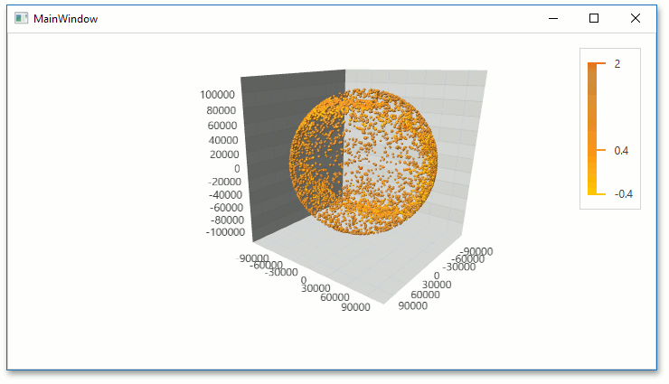

<!-- default badges list -->

<!-- default badges end -->

# Chart for WPF - Create a 3D Chart Control with a Series Bound to Data

The example shows how to create a 3D Chart Control, bind it to a data source, and configure the chart appearance.

## Files to Review

* **[MainWindow.xaml](./CS/GettingStarted2/MainWindow.xaml) (VB: [MainWindow.xaml](./VB/GettingStarted2/MainWindow.xaml))**
* [Star.cs](./CS/GettingStarted2/Star.cs) (VB: [Star.vb](./VB/GettingStarted2/Star.vb))
* [StarDataViewModel.cs](./CS/GettingStarted2/StarDataViewModel.cs) (VB: [StarDataViewModel.vb](./VB/GettingStarted2/StarDataViewModel.vb))

## More Examples 

* [Chart for WPF - Create a Simple Unbound 3D Chart](https://github.com/DevExpress-Examples/wpf-pivot-create-unbound-3d-chart)
* [Chart for WPF - Create a 3D Chart with Automatically Generated Series](https://github.com/DevExpress-Examples/wpf-chart-create-3d-chart-with-automatically-generated-series)

## Documentation 

[Lesson 2 - Create a 3D Chart Control with a Series Bound to Data](https://docs.devexpress.com/WPF/117584/controls-and-libraries/charts-suite/chart3d-control/getting-started/lesson-2-create-a-chart3d-control-with-a-series-bound-to-data)
<!-- feedback -->
## Does this example address your development requirements/objectives?

 

(you will be redirected to DevExpress.com to submit your response)
<!-- feedback end -->
